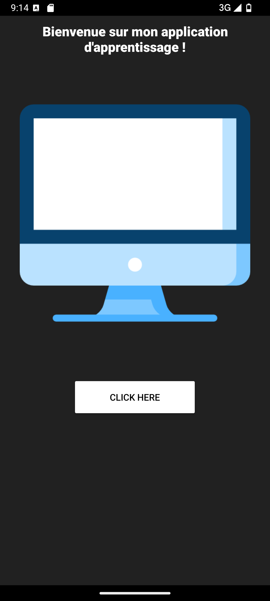
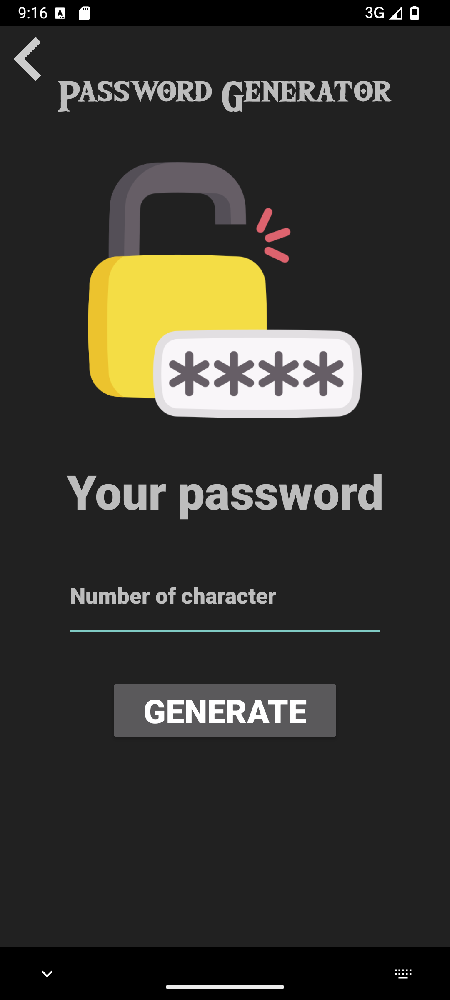
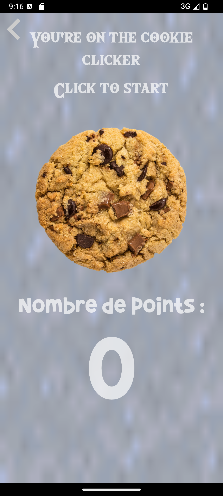

# Learning Application

## About the Project

**Learning Application** is an Android app developed in 2022 using Android Studio. This project was created as a personal learning exercise to explore and understand Android development. The application features simple functionalities, including a home screen, a password generator, and a cookie clicker mini-game.

### Key Features

- **Home Screen**: The central hub to navigate through the application.
- **Password Generator**: A tool to create random secure passwords.
- **Cookie Clicker**: A fun and interactive mini-game.

### Screenshots

Below are placeholders for screenshots showcasing the application's functionality:

1. **Home Screen**  
   

2. **Password Generator**  
   

3. **Cookie Clicker**  
   

---

## How to Use

1. Download the APK from the [Releases](https://github.com/Beltium/LearningApplication/releases) section.
2. Transfer the APK to your Android device, if necessary.
3. Open the APK file on your device and follow the instructions to install it.
4. Once installed, launch the app and explore its features!

---

## Release

### Current Version: [v1.0](https://github.com/Beltium/LearningApplication/releases)

The first and only release of this application is available for download in the GitHub releases section.

---

## License

This project is licensed under the MIT License. See the [LICENSE](LICENSE) file for more details.  
